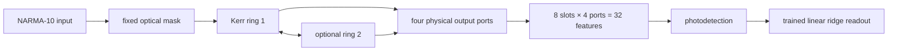

# Kerr Ring Reservoir

An open research repository investigating the physical and computational
feasibility of a **task-designed Kerr-nonlinear microring reservoir** under
realistic optical-power, memory, and readout constraints.

> **Evidence boundary — read first.**
> This repository does not yet report a completed Kerr-reservoir result, a
> fabricated photonic integrated circuit, or an experimental measurement.
> Work completed so far covers blind-evaluation safety, mode-solver reliability,
> cavity-memory requirements, and the physical readout budget. Material
> feasibility, nonlinear dynamics, operating-region search, ring geometry,
> robustness, 3D EM validation, and the final blind evaluation remain open.
> The blind NARMA-10 suite has **not been consumed**, and no paid EM solve has
> been used in this repository.

## Supervisor quick start

For a concise technical review, read these documents in order:

1. [`docs/PROJECT-CHARTER.md`](docs/PROJECT-CHARTER.md) — research scope,
   success criteria, and stop conditions.
2. [`studies/plan2-kerr/README.md`](studies/plan2-kerr/README.md) — current
   technical status and primary findings.
3. [`BACKLOG.md`](BACKLOG.md) — closed gates, open work, and evidence links.
4. [`docs/inherited/OPTICAL-PARAMETER-STATUS.md`](docs/inherited/OPTICAL-PARAMETER-STATUS.md)
   — why inherited optical parameters are not accepted as production inputs.

The canonical research plan is the
[`Plan 2 Kerr Reservoir ADR`](docs/decisions/2026-09-14-plan2-kerr-reservoir.md).

## Research question

Can a one- or two-ring Si₃N₄/SiO₂ or AlGaAsOI architecture provide the memory
and nonlinear transformation required for NARMA-10, while remaining within
accessible optical power, cavity lifetime, and physical-readout constraints?

Success requires one pre-registered candidate to achieve, on ten blind seeds:

- median NMSE `< 0.05`;
- at least 8/10 seeds with NMSE `< 0.05`;
- superiority to re-optimized controls under the same data split and readout;
- traceable source-supported or EM-supported physical parameters.

A well-supported negative result is considered a valid research outcome.

## Architecture concept



Memory is intended to arise primarily from the photon lifetime of the cavity;
the nonlinear transformation comes from the Kerr-induced resonance shift. The
readout may not add digital delay taps: any task advantage must originate in the
physical optical state. Only the final linear ridge readout is trained.

## Current status

| Gate / phase | Purpose | Status |
|---|---|---|
| G0 | Fail-closed blind-evaluation path | **CLOSED** |
| G1 | Si and SiN mode-solver health check | **CLOSED — conditional PASS** |
| G2 | `Q`–`T_sym`–memory feasibility boundary | **CLOSED** |
| SLOT | Physical readout budget | **LOCKED: 8 slots × 4 ports = 32 features** |
| P0 | Benchmark, provenance, and evidence contract | **CLOSED** |
| P1 | Source-supported material and power feasibility | **OPEN** |
| P2 | Dynamical Kerr core | **OPEN** |
| P3 | Nonlinearity–memory operating region | **OPEN** |
| P4 | Ring and coupler geometry | **OPEN** |
| P5 | Pre-registered 64-scenario robustness gate | **DRAFT / OPEN** |
| P6 | 3D EM validation and single final blind test | **OPEN** |

G1's conditional pass does not authorize a single simulated `n_eff` value as a
production parameter. Sub-cell grid alignment produces a measurable numerical
artifact; production inputs must be offset-averaged and carry the observed
alignment spread as uncertainty.

## Main findings to date

### 1. Memory is the first bottleneck

The Kerr response is effectively instantaneous at the task timescale, so the
NARMA-10 memory must be carried by cavity photon lifetime. G2 derived the
platform-independent lower bound

```text
Q_floor = m · ω₀ · N / (ln(1/ε) · B)
```

where `m` is the required history depth, `N` the number of mask slots, `B` the
drive bandwidth, and `ε` the retained-energy threshold. The original
`20-slot, 50 GHz, ε=1/e` design left the candidate region empty.

A noise-floor study adopted a working value of `ε = 10⁻²`, and the physical
readout was subsequently locked to **8 slots × 4 ports**. At that working point:

| Quantity | Working requirement |
|---|---:|
| Symbol period | `160 ps` |
| Physical features | `32` |
| Loaded quality factor | `Q_L ≥ 4.22 × 10⁵` |
| Intrinsic Q at critical coupling | `Q_i ≥ 8.44 × 10⁵` |
| Equivalent loss ceiling (`n_g = 2`) | `≤ 0.417 dB/cm` |

These are **design requirements**, not measurements from a selected or
fabricated device. See
[`MEMORY-TRIANGLE.md`](studies/plan2-kerr/MEMORY-TRIANGLE.md) and
[`RETENTION-NOISE-FLOOR.md`](studies/plan2-kerr/RETENTION-NOISE-FLOOR.md).

### 2. The mode solver is usable, but a single grid alignment is not

Missing subpixel averaging explained a major part of the earlier `n_eff`
instability. A later sub-cell alignment study showed an additional
approximately `1.4 × 10⁻²` variation even with subpixel averaging enabled.
Mesh refinement did not eliminate this effect, whereas four-offset averaging
converged to `5.0 × 10⁻⁴` between the final two meshes.

The resulting rule is:

- single-offset values are diagnostic only;
- production `n_eff/n_g` inputs use four sub-cell offsets;
- alignment spread, rather than mesh-to-mesh difference alone, is reported as
  numerical uncertainty.

See [`G1-ALIGNMENT.md`](studies/plan2-kerr/G1-ALIGNMENT.md).

### 3. Resonance alignment dominates the fabrication-risk picture

Offset-averaged geometry sensitivities are:

| Cross-section | `dλ/dw` | `dλ/dh` |
|---|---:|---:|
| Si `450 × 220 nm` | `813.95 pm/nm` | `1425.79 pm/nm` |
| SiN `1200 × 800 nm` | `83.37 pm/nm` | `147.63 pm/nm` |

At the working `Q_L`, a 1 nm width error still shifts the SiN resonance by
about 23 linewidths. Active trimming is therefore a required architectural
element, not an optional refinement.

The corrected gap sweep shows the expected exponential decrease of coupling
coefficient `κ`. A ±10 nm gap error changes `Q_e` by approximately 11–18%,
while resonance displacement remains the dominant risk. Absolute coupling
lengths still require an offset-averaged remeasurement in the final ring–bus
geometry.

See [`P5-SCENARIO-DESIGN.md`](studies/plan2-kerr/P5-SCENARIO-DESIGN.md).

## What has and has not been demonstrated

**Demonstrated within the stated evidence levels:**

- a single-use, fail-closed blind-evaluation path;
- a closed-form cavity-memory quality-factor boundary;
- a noise-grounded working retention threshold;
- an 8-slot × 4-port physical readout contract;
- the grid/subpixel/alignment failure mechanism of the local mode solver;
- Si and SiN geometry sensitivity and the qualitative gap–`κ` trend.

**Not yet demonstrated:**

- a Kerr-ring core meeting the NARMA-10 target;
- one internally consistent material/platform row satisfying P1;
- independent physical observability across two rings and four ports;
- thermal drift, trimming power, and bistability limits;
- final ring–bus coupling, converged 3D EM evidence, or fabrication;
- any experimental result or final blind Kerr-reservoir score.

## Repository map

```text
docs/PROJECT-CHARTER.md      scope, targets, and stop conditions
docs/decisions/              decisions, corrections, and supersessions
docs/inherited/              historical records inherited from the prior line
studies/plan2-kerr/          technical reports and experiment records
plan2_kerr/                  memory, noise, provenance, and readout calculations
fdtd/modes/                  mode-solver diagnostics and sensitivity tools
benchmarks/narma10_np/       benchmark and blind-test safeguards
manifests/narma10/           development/blind dataset commitments
reports/                     machine-readable evidence and credit ledger
tests/                       benchmark, Plan 2, and mode-solver tests
BACKLOG.md                   canonical execution order
```

Files under `docs/inherited/` are research history, not current production
instructions. The status of every inherited optical parameter is stated
explicitly.

## Local verification

```bash
python -m tests.narma10_np.run_tests
python -m tests.plan2_kerr.run_tests
python -m plan2_kerr.provenance verify
python -m plan2_kerr.screen --boundary
```

Mode-solver checks use the locked Tidy3D environment:

```powershell
./.venv-mode-211/Scripts/python.exe -m tests.fdtd.run_tests
./.venv-mode-211/Scripts/python.exe -m fdtd.modes env
```

Raw HDF5 files, API keys, and large solver outputs are excluded from Git. A new
paid solve requires a live balance check, a written cost estimate, and explicit
approval.

## Relationship to the prior research line

This repository is intentionally separate from the
`Nonlinear-3D-FDTD-Photonic-Reservoir` recovery line. The earlier silicon K0–K5
work is not canonical here; only explicitly migrated benchmark contracts and
retraction records are inherited. See the
[`repository migration decision`](docs/decisions/2026-09-14-repo-migration.md).

---

*Status as of 15 September 2026: G0/G1/G2/P0 closed; readout locked at 8×4;
P1–P6 open; no physical acceptance and no blind Kerr-reservoir result.*
